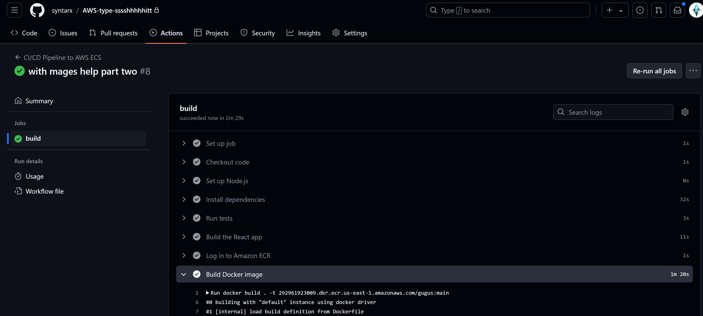

# Architecture Ref.Card 02 - React Application (serverless)

Link zur Übersicht<br/>
https://gitlab.com/bbwrl/m346-ref-card-overview

## Installation der benötigten Werkzeuge

Für das Bauen der App wird Node bzw. npm benötigt. Die Tools sind unter 
der folgenden URL zu finden. Für die meisten Benutzer:innen empfiehlt sich 
die LTS Version.<br/>
https://nodejs.org/en/download/

Node Version Manager<br/>
Für erfahren Benutzer:innen empfiehlt sich die Installation des 
Node Version Manager nvm. Dieses Tool erlaubt das Installiert und das 
Wechseln der Node Version über die Kommandozeile.<br/>
**Achtung: Node darf noch nicht auf dem Computer installiert sein.**<br/>
https://learn2torials.com/a/how-to-install-nvm


## Inbetriebnahme auf eigenem Computer

Projekt herunterladen<br/>
```git clone git@gitlab.com:bbwrl/m346-ref-card-02.git```
<br/>
```cd architecture-refcard-02```

### Projekt bauen und starten
Die Ausführung der Befehle erfolgt im Projektordner

Builden mit Node/npm<br/>
```$ npm install```

Loginangaben mit secrets weitergeben:


Das Projekt wird gebaut und die entsprechenden Dateien unter dem Ordner node_modules gespeichert.

Die App kann nun mit folgendem Befehl gestartet werden<br/>
```$ npm start```

Die App kann nun im Browser unter der URL http://localhost:3000 betrachtet werden.

## Inbetriebnahme mit Docker Container

### Erstellen des Docker Images

Um die Anwendung in einem Docker Container zu betreiben, wird ein Docker Image benötigt. Ein Dockerfile, das die Build-Schritte definiert, befindet sich im Projekt. 

```bash
docker build -t react-app .
```

Container Registry hat funktioniert:


# AWS Kabis

## Lieber Meister Cavuoti

Dieses AWS Zeugs hat mich schier in den Wahnsinn getrieben. Doch ein Magier aus unserer Klasse konnte mir etwas unter die Arme greifen. Hier mein Beweis-Screenshot, dass es funktioniert hat:
